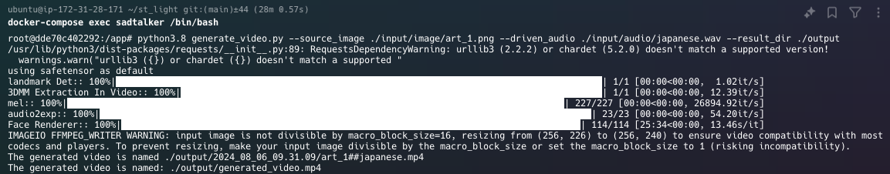

# sd_light

Dockerを使用してSadTalkerモデルを設定し、画像と音声ファイルから動画を生成します。

## ファイル構成

```
.
├── Dockerfile
├── docker-compose.yml
├── requirements.txt
├── scripts
│   └── download_models.sh
├── input
│   ├── image
│   │  └── art_1.png
│   └── audio
│      └── japanese.wav
├── output
├── src
│   ├── audio2exp_models
│   ├── audio2pose_models
│   ├── face3d
│   ├── facerender
│   ├── utils
│   ├── generate_batch.py
│   ├── generate_facerender_batch.py
│   └── test_audio2coeff.py
├── sadtalker.py
└── generate_video.py

```

## セットアップ

1. 必要なモデルファイルをダウンロードし、`models`ディレクトリに配置します。

```sh
bash scripts/download_models.sh
```

2. Dockerイメージをビルドします。

```sh
docker-compose build
```

3. Docker環境を起動します。

```sh
docker-compose up
```

4. Dockerコンテナに入ります。
```sh
docker-compose exec sadtalker /bin/bash
```


## 使用例

次のようにコマンドを実行して動画を生成します。

```sh
python3.8 generate_video.py --source_image ./input/image/art_1.png --driven_audio ./input/audio/japanese.wav --result_dir ./output
```

このコマンドで生成した動画は[こちら](output/generated_video.mp4)に格納しています。

### 動作確認の実行環境
以下のスペックのAWS EC2インスタンスで実行しました。

- インスタンスタイプ: g4dn.xlarge
- vCPU: 4
- メモリ: 16 GiB
- GPU: NVIDIA T4 Tensor Core GPU 1基
- ストレージ: 125 GB NVMe SSD
- オペレーティングシステム: Ubuntu 20.04 LTS




## 対応ファイル形式

- 画像: .jpg, .png
- 音声: .wav
- 動画出力: .mp4

## Appendix

このレポジトリは、[SadTalker](https://github.com/OpenTalker/SadTalker)を元に作成されました。
